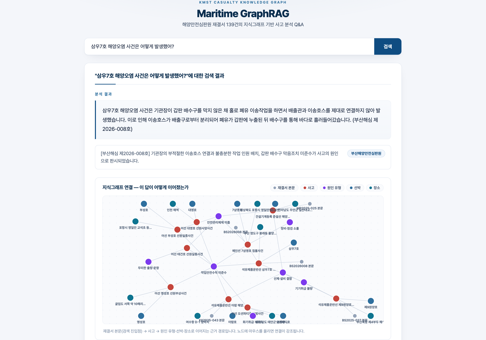

<p align="center">
  <a href="README.md">English</a> | <a href="README.ko.md">한국어</a>
</p>

<h1 align="center">Maritime GraphRAG</h1>

<p align="center">해양 도메인(선박·선사·항만·규제·사고) 특화 Neo4j 지식그래프 RAG 엔진 — 정답 있는 멀티홉 검색 벤치마크(벡터 0.70 → 그래프 질의 0.85) + 실제 해양안전심판 재결서 139건의 크로스 문서 원인 분석</p>

<p align="center">
  
  
  
  
  
</p>

해양 산업의 질문은 본질적으로 관계형입니다: *"부산항에 컨테이너선을 기항시키는
선사는?"* 은 선사→선박→항만 조인이고, *"울산항 사고 선박에 적용되는 환경 규제는?"*
은 사고→선박→선종→규제 체인입니다. 순수 벡터 검색은 각 엔티티에 대한 문서는
찾아도 이 조인을 수행하지 못합니다. 이 프로젝트는 해양 뉴스 위에 2계층 Neo4j
그래프(문서 + 타입 엔티티)를 구축하고, 에이전틱 검색기 라우터(FastAPI + React)로
서빙하며, **그래프가 실제로 얼마나 기여하는지 측정**합니다.

## 검색 벤치마크 — 그래프는 값을 하는가?

실제 뉴스에는 정답이 없으므로, 저장소에 **합성 해양 세계**(가상 선사 6, 선박 14,
항만 6, 규제 4, 사고 6)를 동봉했습니다 — 모든 관계가 생성 시점에 확정되어
있습니다. 뉴스 스타일 기사 42건이 이 관계를 서술하고, 관계 테이블에서 QA 20문항을
도출했습니다. 멀티홉 문항의 답은 **어느 단일 기사에도 존재하지 않습니다**.
무검색(no-retrieval) 대조군으로 가상 엔티티가 GPT-4o의 사전지식으로는 답할 수
없음을 확인했습니다.

같은 LLM(gpt-4o, temp 0), 같은 답변 프롬프트에서 검색 방식만 바꿔 비교합니다.
채점 = 생성된 답변에 정답 엔티티가 포함됐는가.
`python evaluation/retrieval_benchmark.py` 로 재현:

| 검색 방식 | 엔티티 recall | Strict acc | 1홉 (n=11) | 2홉 (n=8) | 3홉 (n=1) |
|---|---|---|---|---|---|
| 무검색 (대조군) | 0.00 | 0.00 | 0.00 | 0.00 | 0.00 |
| 벡터 (top-5 청크) | 0.73 | 0.70 | 0.91 | 0.38 | 1.00 |
| 그래프 확장 (VectorCypher) | 0.82 | 0.75 | 0.91 | 0.50 | 1.00 |
| **Text2Cypher (그래프 직접 질의)** | **0.85** | **0.85** | **1.00** | **0.75** | 0.00 |


**수치가 말하는 것:**

- **벡터 검색은 멀티홉에서 무너집니다** (1홉 0.91 → 2홉 0.38): 조인된 답 집합이
  검색 가능한 어떤 청크에도 없기 때문입니다.
- **그래프 확장이 일부를 회복합니다** (0.50): 검색된 청크에 언급 엔티티의 관계
  사실(`X -OPERATES- Y`)을 덧붙이면 LLM이 컨텍스트 안에서 일부 조인을 수행합니다.
- **그래프 직접 질의가 전체 최고입니다** (strict 0.85, 1홉 1.00) — 질문이 Cypher
  패턴에 대응되면 조인이 LLM이 아니라 데이터베이스에서 일어납니다.
- **단, Text2Cypher는 복잡한 체인에 취약합니다**: 3홉 문항과 일부 2홉 변형에서
  형태는 그럴듯하지만 결과가 빈 Cypher가 생성됐습니다(더 싼 검색기가 맞힌 문제에서
  0점). 어떤 검색기도 전 구간을 지배하지 못한다는 것 — 이것이 질문마다 전략을
  고르는 앱의 **에이전틱 라우터**(`ToolsRetriever`)의 실증적 근거입니다.

과정에서 발견·수정한 것: Text2Cypher 답변의 근거화(grounding)에는 값과 함께
**주체를 반환**해야 합니다(`RETURN v.name, v.type` — 값만 반환하면 답변 LLM이
근거 불충분으로 거부). 또 Neo4j 자동 추출 스키마는 잘못된 Cypher를 유발해,
`app.py`의 큐레이션된 스키마 텍스트가 벤치마크로 검증된 버전입니다.

## 2부 — 실데이터: 해양안전심판 재결서 139건

위의 합성 벤치마크가 *방법*을 검증했다면, 2부는 그 방법을 실제 문서에 적용해
**이전에 존재하지 않던 지식**을 만듭니다. 중앙해양안전심판원(해심원)은 조사한
모든 해양사고에 대해 재결서를 공개합니다 — 각 재결서는 한 사고의 선박, 장소,
기상, **판시된 원인 사슬**, 처분을 서술합니다. 2025–2026년 전국 심판원의 재결서
139건을 파싱(PDF/HWP/HWPX)하고, LLM으로 고정 원인 분류 체계에 정규화해 그래프로
적재했습니다:

```
(Accident {type, night, weather})-[:INVOLVES]->(AVessel {type, tonnage})
(Accident)-[:HAS_CAUSE]->(Cause)-[:OF_TYPE]->(CauseCategory)
(Cause)-[:LEADS_TO]->(Cause)          # 판시된 원인 사슬
(Accident)-[:IMPOSED]->(Sanction)     (Accident)-[:CITES]->(Law)
```

**각 재결서는 자기 사고만 설명합니다. 그래프는 어떤 단일 문서에도 없는 질문에
답합니다:**

| 크로스 문서 질문 | 그래프의 답 (139건) |
|---|---|
| 가장 많이 반복되는 원인 사슬은? | **"작업안전수칙 미준수 → 안전관리체제 미흡": 22건.** 개인 과실이 조직적 실패의 증상으로 반복 판시되고 있음. |
| 충돌 사고를 지배하는 원인은? | 경계 소홀: 충돌 35건에서 원인 판시 44회 — 주간·야간 빈도가 같고(24 vs 24), 조선 부적절·기상 요인은 야간에 집중. |
| 어선 vs 상선의 차이는? | 어선 사고가 경계 소홀(38 vs 14)과 정비·점검 소홀(13 vs 2)을 압도 — 뚜렷이 다른 리스크 프로필. |
| 가장 무거운 처분을 부르는 원인은? | 적재·고박 불량: 평균 업무정지 6.6개월 (경계 소홀은 1.8개월). |


재현: `ingest/fetch_kmst_verdicts.py` (또는 수동 다운로드한 재결서 파일을
`data/kmst/manual/`에 넣고 `ingest/parse_manual_verdicts.py`) →
`ingest/extract_accidents.py` → `graph/build_accident_graph.py` →
`evaluation/accident_insights.py`. 추출된 구조화 레코드
(`data/kmst/accidents_graph.json`)가 커밋되어 있어 재수집이나 OpenAI 키 없이도
그래프와 분석을 재현할 수 있습니다. 원문서는 해양안전심판원의 공공저작물
(공공누리)입니다. 아래 애플리케이션은 전적으로 이 실데이터 코퍼스 위에서 동작하며, 1부의 합성
세계는 검색 벤치마크 전용입니다.

## 그래프 스키마

```
문서 계층    (Article)-[:HAS_CHUNK]->(Content {embedding})
             (Article)-[:PUBLISHED_BY]->(Media)   (Article)-[:BELONGS_TO]->(Category)
             (Article)-[:MENTIONS]->(엔티티)
지식 계층    (Company)-[:OPERATES]->(Vessel {type})
             (Vessel)-[:CALLS_AT]->(Port)
             (Regulation)-[:APPLIES_TO]->(Vessel)
             (Vessel)-[:INVOLVED_IN]->(Incident)-[:OCCURRED_AT]->(Port)
```

동봉 코퍼스의 지식 계층은 정답 테이블(`data/corpus/entities.json`)에서 적재하고,
실제 문서에는 `ingest/extract_entities.py`(LLM 추출기)가 같은 구조를 생성합니다.

## 애플리케이션 — 실제 사고 그래프 Q&A

애플리케이션은 **실데이터(2부) 코퍼스**를 서빙합니다: FastAPI 백엔드가 재결서
139건 그래프 위에서 3개 검색기(재결서 본문 벡터 검색 / 원인·선박·처분이 결합된
그래프 확장 / Text2Cypher 직접 질의)를 LLM 라우터로 선택합니다. 모든 답변은
**근거 서브그래프** — 검색에 사용된 재결서 청크, 그 청크가 속한 사고, 사고에
연결된 원인·선박·장소 — 를 함께 반환하고, 프론트엔드가 d3-force 인터랙티브
그래프로 렌더링해 검색 경로가 눈에 보이게 합니다:


| 랜딩 | 개별 사고 질문 — 청크 → 사고 → 원인 |
|---|---|
|  |  |

## 빠른 시작

```bash
# 0. Neo4j
docker run -d --name maritime-neo4j -p 7474:7474 -p 7687:7687 \
  -e NEO4J_AUTH=neo4j/maritime123 neo4j:5

# 1. 파이썬 환경 + 키
pip install -r requirements.txt
cp .env.example .env            # OPENAI_API_KEY, NEO4J_PASSWORD 설정

# 2. 합성 코퍼스 생성 + 그래프 구축 (청크 42개 임베딩)
python ingest/generate_corpus.py
python graph/build_graph.py

# 3. 벤치마크 실행
python evaluation/retrieval_benchmark.py

# 4. 서빙
uvicorn app:app --port 8001               # 백엔드
cd frontend && npm install && npm run dev # 프론트엔드 (localhost:5173)
```

## 저장소 구조

| 경로 | 내용 |
|---|---|
| `ingest/generate_corpus.py` | 합성 해양 코퍼스 + 관계 테이블 + QA 벤치마크 (결정론적) |
| `ingest/extract_entities.py` | 실제 문서용 LLM 엔티티/관계 추출기 (동일 출력 스키마) |
| `graph/build_graph.py` | 2계층 Neo4j 구축: 문서·청크·임베딩·타입 엔티티 |
| `evaluation/retrieval_benchmark.py` | 4개 검색 전략 비교, 정답 엔티티 채점 |
| `ingest/fetch_kmst_verdicts.py`, `ingest/parse_manual_verdicts.py` | 재결서 수집 (웹 + 수동 PDF/HWP/HWPX 파싱) |
| `ingest/extract_accidents.py` | 원인 사슬을 고정 분류 체계로 LLM 추출 |
| `graph/build_accident_graph.py`, `evaluation/accident_insights.py` | 사고 레이어 구축 + 크로스 문서 원인 분석 |
| `app.py` | FastAPI + 에이전틱 검색기 라우터 + 인용 근거 생성 |
| `frontend/` | React (Vite) 검색 UI |
| `data/` | 커밋된 코퍼스, 엔티티 테이블, QA 벤치마크 |

## 한계

- 벤치마크 코퍼스는 합성이며 소규모입니다(기사 42, QA 20). 수치는 동일 조건에서의
  검색 전략 간 비교이지 절대적 프로덕션 품질 추정이 아닙니다. 기사가 템플릿 문체라
  실제 뉴스의 패러프레이즈·노이즈가 더해지면 전 행이 하락하며, 벡터가 가장 크게
  하락할 가능성이 높습니다.
- 수치는 temperature 0의 단일 실행입니다. 특히 Text2Cypher 실패는 프롬프트 표현에
  따라 변동합니다.
- 2부는 LLM 추출(gpt-4o)에 의존합니다: 원인 분류가 사람 검증을 거치지 않았고,
  코퍼스는 최근(2025–26) 139건으로 종단 표본이 아닙니다 — 인사이트는 그래프의
  분석 능력 시연으로 읽어야 하며, 해양 안전 통계로 인용해선 안 됩니다.
- 데모의 지식 계층은 정답 테이블에서 적재되어 검색 품질을 추출 노이즈와 분리해
  측정합니다. 실데이터에 `extract_entities.py`를 쓰면 추출 오류가 이 수치 위에
  더해집니다.

## 관련 프로젝트

- [Parse-Everything](https://github.com/chaeminyoon/Parse-Everything) — 자가 치유 문서 파싱 (RAG 코퍼스의 상류 공정)
- [Vehicle-Anomaly-Algorithm](https://github.com/chaeminyoon/Vehicle-Anomaly-Algorithm) · [AIS-Traffic-Model](https://github.com/chaeminyoon/AIS-Traffic-Model) · [CBM-Anomaly-Dashboard](https://github.com/chaeminyoon/CBM-Anomaly-Dashboard) — 이 프로젝트가 지식 검색으로 확장하는 해양·교통 AI 라인
