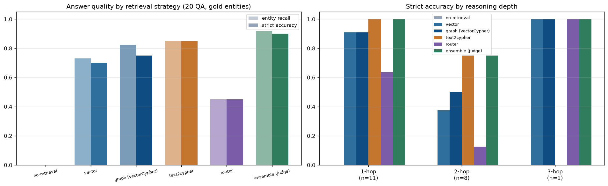
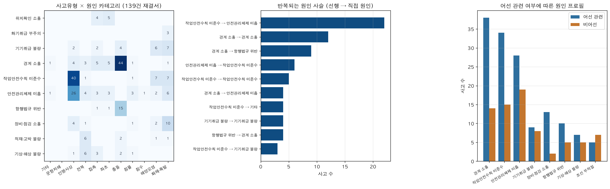
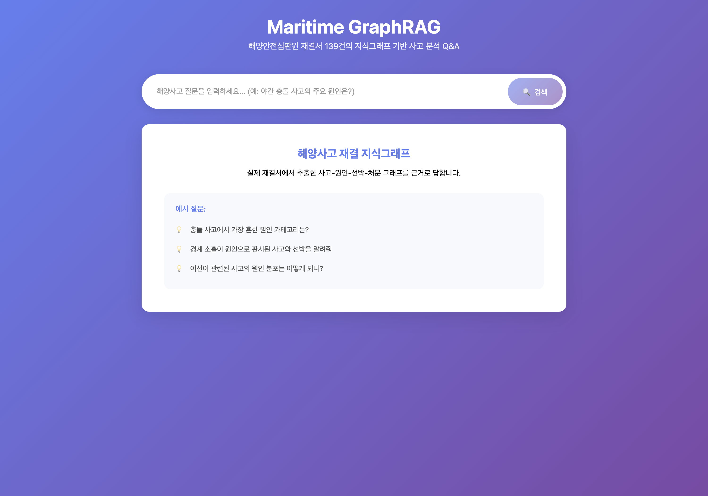
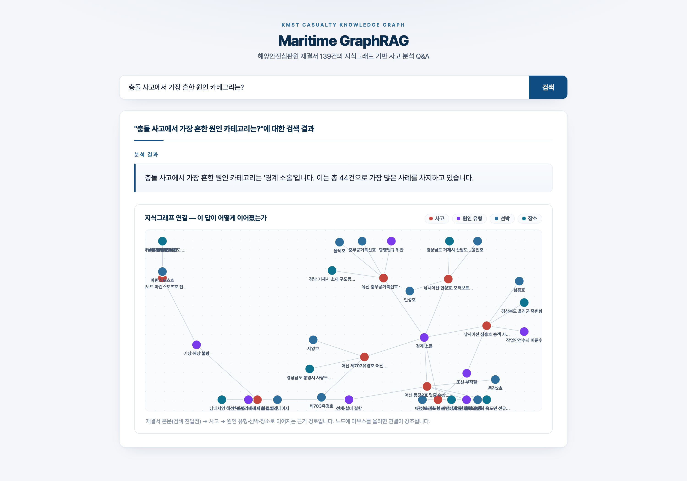

<p align="center">
  <a href="README.md">English</a> | <a href="README.ko.md">한국어</a>
</p>

<h1 align="center">Maritime GraphRAG</h1>

<p align="center">A Neo4j knowledge-graph RAG engine for the maritime domain — vessels, operators, ports, regulations and incidents — a ground-truth multi-hop retrieval benchmark (vector 0.70 → graph query 0.85), and cross-document causal insights from 139 real KMST casualty adjudications</p>

<p align="center">
  
  
  
  
  
</p>

Maritime questions are relational by nature: *"Which operators call container ships
at Busan?"* joins operator→vessel→port; *"Which environmental rule applies to the
ship that had the Ulsan incident?"* chains incident→vessel→type→regulation. Pure
vector search retrieves documents about each entity but cannot join them.
This project builds a two-layer Neo4j graph (documents + typed entities) over
maritime news, serves it through an agentic retriever router (FastAPI + React),
and **measures** how much the graph actually helps.

## Retrieval benchmark — does the graph earn its keep?

Real news gives no ground truth, so the repo ships a **synthetic maritime world**
(6 fictional operators, 14 vessels, 6 ports, 4 regulations, 6 incidents) where every
relation is known by construction. 42 news-style articles express those relations in
prose; 20 QA pairs are derived from the relation tables — including multi-hop
questions **whose answer appears in no single article**. A no-retrieval control
proves the fictional entities cannot be answered from GPT-4o's parametric memory.

Same LLM (gpt-4o, temp 0), same answer prompt; only retrieval varies.
Score = gold entities present in the generated answer. Reproduce with
`python evaluation/retrieval_benchmark.py`:

| Retrieval | Entity recall | Strict acc | 1-hop (n=11) | 2-hop (n=8) | 3-hop (n=1) |
|---|---|---|---|---|---|
| No retrieval (control) | 0.00 | 0.00 | 0.00 | 0.00 | 0.00 |
| Vector (top-5 chunks) | 0.73 | 0.70 | 0.91 | 0.38 | 1.00 |
| Graph expansion (VectorCypher) | 0.82 | 0.75 | 0.91 | 0.50 | 1.00 |
| **Text2Cypher (direct graph query)** | **0.85** | **0.85** | **1.00** | **0.75** | 0.00 |



**What the numbers say:**

- **Vector search collapses on multi-hop** (0.91 → 0.38 strict accuracy going from
  1-hop to 2-hop): the joined answer set exists in no retrievable chunk.
- **Graph expansion recovers part of it** (0.50): appending entity facts
  (`X -OPERATES- Y`) from mentioned entities to each retrieved chunk lets the LLM
  do some joins in-context.
- **Direct graph querying wins overall** (0.85 strict, 1.00 on 1-hop) — when the
  question maps to a Cypher pattern, the join happens in the database, not the LLM.
- **But Text2Cypher is brittle on complex chains**: the 3-hop question and one
  2-hop variant produced valid-looking but empty Cypher (score 0 where the cheaper
  retrievers succeeded). No single retriever dominates — which is the empirical
  justification for the app's **agentic router** (`ToolsRetriever`) that picks a
  strategy per question.

Found along the way (fixed and kept honest): grounding Text2Cypher answers requires
returning the *subject* alongside the value (`RETURN v.name, v.type` — a bare
`v.type` row made the answer LLM refuse), and the auto-extracted Neo4j schema
produced malformed Cypher — the curated schema text in `app.py` is what the
benchmark validated.

## Part 2 — Real data: 139 adjudicated marine casualties

The synthetic benchmark above validates the *method*; this part applies it to
real documents and creates knowledge that did not exist before. The Korean
Maritime Safety Tribunal (KMST) publishes an adjudication report for every
investigated marine casualty — each narrating a single accident's vessels,
location, weather, **causal chain of findings**, and sanctions. 139 reports
(2025–2026, all regional tribunals) were parsed (PDF/HWP/HWPX), extracted with
an LLM onto a fixed cause taxonomy, and loaded as a graph:

```
(Accident {type, night, weather})-[:INVOLVES]->(AVessel {type, tonnage})
(Accident)-[:HAS_CAUSE]->(Cause)-[:OF_TYPE]->(CauseCategory)
(Cause)-[:LEADS_TO]->(Cause)          # the adjudicated causal chain
(Accident)-[:IMPOSED]->(Sanction)     (Accident)-[:CITES]->(Law)
```

**Every report explains only its own accident. The graph answers questions that
exist in no single document:**

| Cross-document question | Answer from the graph (139 cases) |
|---|---|
| Which causal chain repeats the most? | **"Work-safety-rule violation → inadequate safety-management system": 22 accidents.** Individual errors are systematically adjudicated as symptoms of organizational failure. |
| What dominates collision findings? | Lookout negligence: 44 cause findings across 35 collisions — equally frequent by day and night (24 vs 24), while ship-handling and weather causes cluster at night. |
| Fishing vessels vs merchant ships? | Fishing-vessel accidents dominate lookout negligence (38 vs 14) and maintenance neglect (13 vs 2) — a materially different risk profile. |
| Which causes draw the heaviest sanctions? | Cargo-securing failures: average 6.6 months of license suspension, vs 1.8 months for lookout negligence. |



Reproduce: `ingest/fetch_kmst_verdicts.py` (or drop manually downloaded verdict
files into `data/kmst/manual/` and run `ingest/parse_manual_verdicts.py`) →
`ingest/extract_accidents.py` → `graph/build_accident_graph.py` →
`evaluation/accident_insights.py`. The extracted structured records
(`data/kmst/accidents_graph.json`) are committed, so the graph and analysis are
reproducible without refetching or an OpenAI key. Source documents are
public-sector works (KOGL) of the Korean Maritime Safety Tribunal. The accident
layer is also wired into the app's Text2Cypher schema, so the frontend answers
real-data questions alongside the synthetic corpus.

## Graph schema

```
Document layer   (Article)-[:HAS_CHUNK]->(Content {embedding})
                 (Article)-[:PUBLISHED_BY]->(Media)   (Article)-[:BELONGS_TO]->(Category)
                 (Article)-[:MENTIONS]->(entity)
Knowledge layer  (Company)-[:OPERATES]->(Vessel {type})
                 (Vessel)-[:CALLS_AT]->(Port)
                 (Regulation)-[:APPLIES_TO]->(Vessel)
                 (Vessel)-[:INVOLVED_IN]->(Incident)-[:OCCURRED_AT]->(Port)
```

For the bundled corpus the knowledge layer loads from ground-truth tables
(`data/corpus/entities.json`); for real documents `ingest/extract_entities.py`
produces the same structure with an LLM extractor.

## Application

FastAPI backend with three retrievers behind an LLM router
(`ToolsRetriever` picks vector / graph-expansion / Text2Cypher per question),
answering in a citation-grounded JSON contract rendered by a React frontend:

| Search | Multi-hop answer |
|---|---|
|  |  |

## Quick start

```bash
# 0. Neo4j
docker run -d --name maritime-neo4j -p 7474:7474 -p 7687:7687 \
  -e NEO4J_AUTH=neo4j/maritime123 neo4j:5

# 1. Python env + keys
pip install -r requirements.txt
cp .env.example .env            # set OPENAI_API_KEY, NEO4J_PASSWORD

# 2. Generate the synthetic corpus and build the graph (embeds 42 chunks)
python ingest/generate_corpus.py
python graph/build_graph.py

# 3. Run the benchmark
python evaluation/retrieval_benchmark.py

# 4. Serve
uvicorn app:app --port 8001            # backend
cd frontend && npm install && npm run dev   # frontend at localhost:5173
```

## Repository layout

| Path | Contents |
|---|---|
| `ingest/generate_corpus.py` | Synthetic maritime corpus + relation tables + QA benchmark (deterministic) |
| `ingest/extract_entities.py` | LLM entity/relation extractor for real documents (same output schema) |
| `graph/build_graph.py` | Two-layer Neo4j build: documents, chunks, embeddings, typed entities |
| `evaluation/retrieval_benchmark.py` | 4-way retrieval comparison with gold-entity scoring |
| `ingest/fetch_kmst_verdicts.py`, `ingest/parse_manual_verdicts.py` | KMST verdict collection (web + manual PDF/HWP/HWPX parsing) |
| `ingest/extract_accidents.py` | LLM extraction of causal chains onto a fixed taxonomy |
| `graph/build_accident_graph.py`, `evaluation/accident_insights.py` | Accident-layer build + cross-document causal analysis |
| `app.py` | FastAPI + agentic retriever router + citation-grounded generation |
| `frontend/` | React (Vite) search UI |
| `data/` | Committed corpus, entity tables, QA benchmark |

## Limitations

- The benchmark corpus is synthetic and small (42 articles, 20 QA); numbers compare
  retrieval strategies under identical conditions rather than estimate absolute
  production quality. Articles are templated prose — real news adds paraphrase and
  noise that would lower all rows, likely vector most.
- Scores are a single run at temperature 0; Text2Cypher failures in particular vary
  with prompt wording.
- Part 2 relies on LLM extraction (gpt-4o): cause-category assignment is not
  human-validated, and the corpus is 139 recent cases (2025–26), not a
  longitudinal sample — read the insights as demonstrations of the graph's
  analytical reach, not as maritime-safety statistics.
- The knowledge layer for the demo comes from ground truth, isolating retrieval
  quality from extraction noise. With `extract_entities.py` on real data, extraction
  errors compound on top of these numbers.

## Related projects

- [Parse-Everything](https://github.com/chaeminyoon/Parse-Everything) — self-healing document parsing (upstream of any RAG corpus)
- [Vehicle-Anomaly-Algorithm](https://github.com/chaeminyoon/Vehicle-Anomaly-Algorithm) · [AIS-Traffic-Model](https://github.com/chaeminyoon/AIS-Traffic-Model) · [cbm-anomaly-detection](https://github.com/chaeminyoon/cbm-anomaly-detection) — the maritime/transport AI line this project extends into knowledge retrieval
